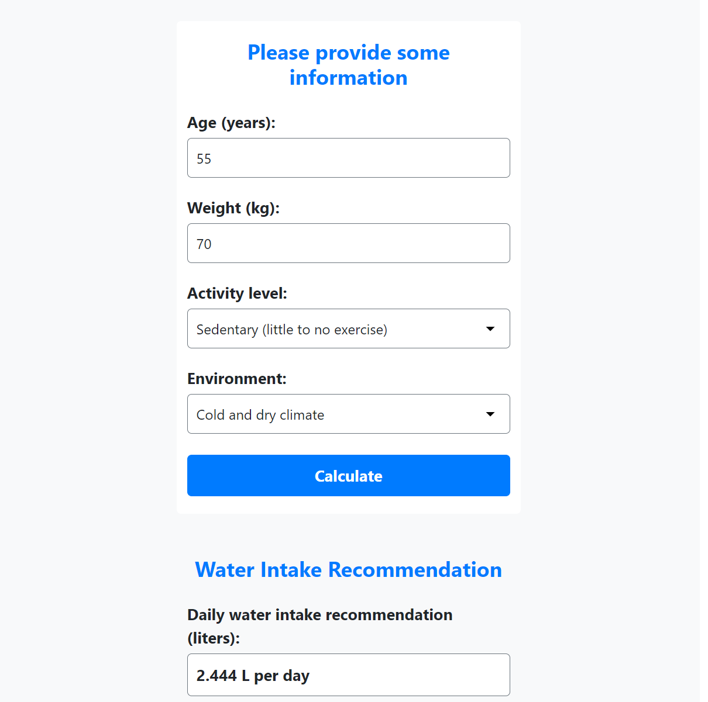

# Water Intake Calculator

This repository contains a simple web application that calculates the recommended daily water intake based on user input. The application was built using HTML, CSS, and JavaScript, and uses Bootstrap for styling.

## Getting Started

To use the application, simply open the `index.html` file in your web browser.

## Usage

The application consists of a form that prompts the user to input their age, weight, activity level, and environment. After the user submits the form, the application calculates the recommended daily water intake and displays it on the page.

## Contributing

Pull requests are welcome. For major changes, please open an issue first to discuss what you would like to change.

Please make sure to update tests as appropriate.

## Screenshots

## Credits

The calculator was created by [Your Name](https://github.com/AhmedS996).
